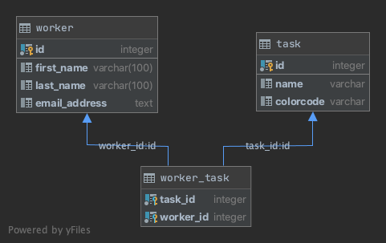

# JAVA EKSAMEN 

Link til github repo: https://github.com/kristiania/pgr203eksamen-Sarahcvd

## Beskrivelse av oppgaven
* Dette prosjektet består av en HTTP-server og klient som kobles til en postgresql database. 
* Vi har laget tester for å se om planlagt funksjonalitet kjøres korrekt (tester mot: server, klient, querystring og database). 
* Hovedklassen i prosjektet er server-klassen, denne kjøres for å starte serveren (forbindelse åpnes på port 8080 - via localhost). 
* Klient-klassen brukes for å "snakke" med serveren, data kan lastes opp og ned til serveren (html/txt objekter og css funksjonalitet). 
* Det er mulig å kommunisere med server i nettleseren. Workerdaoklassen lagrer bruker-input fra nettleser til databasen.
* Vi har laget threads i en uendelig "while-loop" for å holde serveren "åpen" sånn at den alltid er tilgjengelig for nye forbindelser. 
* Kode for å stenge forbindensen er også lagd inn, "connection-close" for at nettsiden ikke står stille når brukeren prøver å kalle på serveren.

# Beskrivelse av hvordan man skal kjøre programmet: 
### Bygg og test executable jar-fil
* Kjør `mvn clean` for å rense /target, kjør deretter `mvn` package for å opprette .jar filen som du skal kjøre. 
* Konfigurasjonsfilen din skal du døpe til `pgr203.properties`, den skal inneholde verdier for: 
  * `dataSource.url = jdbc:postgresql://localhost:5432/` + og navnet på databasen din
  * `dataSoure.username  = ` ditt brukernavn på databasen 
  * `dataSource.password = ` passordet til brukeren
  
* Etter å ha kjørt `mvn package` kan du kjøre serveren gjennom å skrive: `java -Dfile.encoding=UTF-8 -jar target/http-client-demo-1.0-SNAPSHOT.jar`
* Når brukeren har opprettet forbindelse mot serveren så har denne mulighet til å lagre informasjon til arbeidere som outputtes i en HTML fil og lagres i en database.

## Funksjonalitet
* Programmet kjøres i nettleseren ved å gå inn på http://localhost:8080
* Når du trykker på `New x` blir du sendt videre så du kan legge til nye elementer i databasen ved å fylle ut skjemaer
* Når du trykker på `List x` vil du få opp en lite av elementene som du har lagt inn 
* På `Edit worker` vil du kunne tildele en ny task til en worker 
* Alle sider har en `Return to main menu` link som tar deg tilbake til forsiden 

# Designbeskrivelse
### Server structure

### Database UML

### HttpServer Diagram 
Lim inn UML 

# Erfaringer med arbeid og løsning

I denne oppgaven har vi vært svært gode til å jobbe sammen. Vi har vært fysisk tilstede hver gang vi har jobbet og dette har gjort at begge har fått en god forståelse av alt vi har gjort, samt at debuggingen har vært mer effektiv da begge vet hva som har blitt kodet. 

Vår erfaring med å løse denne oppgaven er at vi i større grad forstår hvordan server og client snakker sammen samt hvordan en server snakker med en database. Dette er ikke noe vi har sett på i tidligere fag. 

Vi mener dette har vært en utfordende oppgave å jobbe med, men vi har vært flinke til å bruke god tid på å forsøk å forstå all koden. Dette føler vi også at vi har gjort, men det vanskeligste er å se sammenhengen mellom alle klassene. Alt i alt synes vi at vi har klart å løse det på en bra måte og vi er fornøyde med resultatet. Vi har fulgt godt med på alle forelesninger og føler vi sitter igjen med en mye større forståelse av Java.

## Evaluering gitt til annen gruppe
https://github.com/kristiania/pgr203eksamen-thensrud/issues

## Evaluering fra en annen gruppe
https://github.com/kristiania/pgr203eksamen-Sarahcvd/issues

#
Prosjektet er bygget ved hjelp av par-programmering av: Sarah Christine van Dijk(Sarahcvd) og Wali Gustav Björk(WaliGustav)
